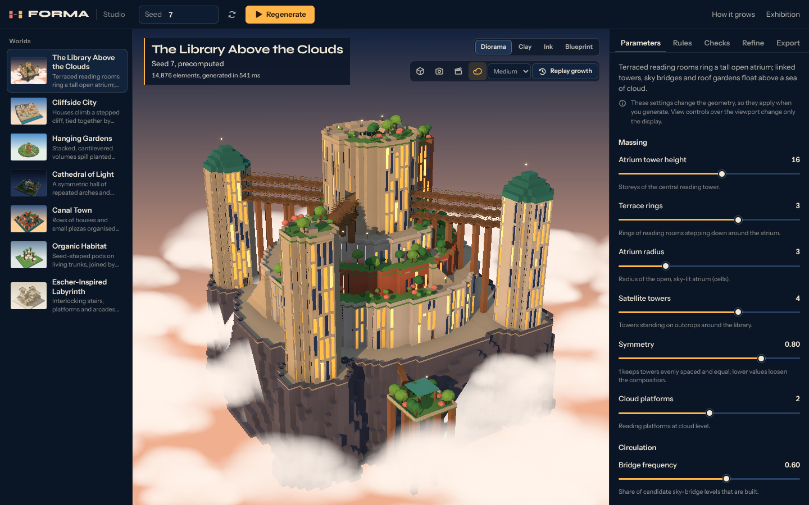
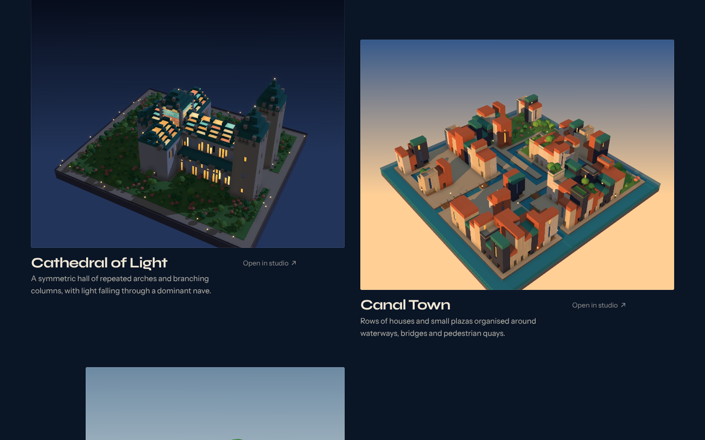

# FORMA: Worlds by Rules

FORMA grows architecture from rules. A Java engine composes a massing from parameters and a seed, rasterises it into a voxel grid, lets MarkovJunior-style rewrite rules grow windows, gardens and details, fills tile lattices with Wave Function Collapse, walks the result to prove every space is reachable, and can refine the composition with a real Metropolis-Hastings sampler. A React and three.js studio shows the result as a lit diorama, lets you replay every recorded stage, read and edit the rules, compare refinements and export images, models and reproducible project files.


Watch the [14-second demo (MP4)](docs/video/forma-demo-14s.mp4) or the [full feature tour (1:42)](docs/video/forma-feature-tour.mp4).



## Quick start

You need **Java 21+** and **Node.js 20+**.

macOS / Linux:

```bash
./scripts/start.sh            # builds the engine and the web app, then serves both on http://localhost:8080
./scripts/start.sh --dev      # engine on :8080 + Vite dev server with hot reload on http://localhost:5173
```

Windows (PowerShell):

```powershell
powershell -ExecutionPolicy Bypass -File scripts\start.ps1
powershell -ExecutionPolicy Bypass -File scripts\start.ps1 -Dev
```

The start scripts build the engine with the Maven Wrapper (`mvnw`, which downloads Maven 3.9.11 on first use). If Maven cannot download anything, they fall back to compiling with plain `javac`, which needs nothing but the JDK. Set `FORMA_PORT` to use another port; set `FORMA_SKIP_MAVEN=1` to go straight to `javac`.

### Doing it by hand

```bash
./mvnw -DskipTests package                       # engine/target/forma-engine.jar, server/target/forma-server.jar
cd web && npm ci && npm run build && cd ..
java -cp server/target/forma-server.jar:engine/target/forma-engine.jar \
     studio.forma.server.FormaServer --port 8080 --web web/dist
```

(On Windows, separate the classpath with `;`.) Without Maven: `./scripts/javac-build.sh` compiles everything into `build/classes`.

### Command line

```bash
java -cp engine/target/forma-engine.jar studio.forma.engine.cli.FormaCli list
java -cp engine/target/forma-engine.jar studio.forma.engine.cli.FormaCli generate canal --seed 21 --param size=14 --out out/canal
java -cp engine/target/forma-engine.jar studio.forma.engine.cli.FormaCli config examples/escher-tall.json --out out/escher
java -cp engine/target/forma-engine.jar studio.forma.engine.cli.FormaCli refine library --seed 7 --iterations 2000 --keep best --out out/refined
```

Each run writes `scene.json`, `replay.json`, `inspector.json` and `config.json` and prints the constraint report.

## The seven worlds

| World | What makes it | Notes |
|---|---|---|
| **A. The Library Above the Clouds** (flagship) | Terraced reading rings around an open atrium, satellite towers, sky bridges, cloud platforms; rules for bays, bookshelves, roof gardens | Clouds are presentation only; grounded mode checks a support heuristic, fantasy mode lets islands float and says so |
| **B. Cliffside City** | Stepped benches with retaining walls, houses, switchback stairs, a ravine crossed only by bridges | Ravine kept open is a hard check |
| **C. Hanging Gardens** | Cantilevered stacks around a courtyard; rules grow planters, vines and waterfalls downward | Every overhang is within the support span limit |
| **D. Cathedral of Light** | Nave, aisles, transept, apse, towers, arcades; a rule grows branching columns into the vault | The nave must stay one uninterrupted interior |
| **E. Canal Town** | 2D tile WFC plan (canals, streets, bridges, plazas, blocks), a 2D rule pass for courtyards, then extrusion | WFC is local; connectivity is repaired and checked by traversal |
| **F. Organic Habitat** | Living trunks with seed-shaped pods on branching struts, walkway tubes between trunks | Curved forms are separate primitives drawn over the voxels; validation runs on the voxels |
| **G. Escher-Inspired Labyrinth** | 3D tile WFC with gravity in the adjacency; opens in true isometric view | An optical illusion, not traversable impossible space: apparent joins are detected and reported as not walkable |



## What is in the box

```
engine/     Java 21 engine: rules, WFC, MCMC, validation, presets, scene builder, CLI (no runtime dependencies)
server/     HTTP API on the JDK's built-in HttpServer: bounded job queue, SSE progress, results, static hosting
web/        React 19 + TypeScript + Vite + three.js (react-three-fiber) studio, landing page and "How it grows"
scripts/    start scripts, javac build, example and image regeneration, measurements
docs/       ENGINE.md, API.md, screenshots
examples/   configs you can run with the CLI or import in the studio
```

* [docs/ENGINE.md](docs/ENGINE.md): how generation works, the rule language, WFC, refinement, validation, determinism.
* [docs/API.md](docs/API.md): the HTTP API.
* [DESIGN.md](DESIGN.md): the visual system and the design refinement log.
* [THIRD_PARTY_NOTICES.md](THIRD_PARTY_NOTICES.md).

## Tests

```bash
./mvnw test                     # JUnit 5: engine + server (54 tests)
./scripts/javac-build.sh --test # the same suite without Maven, using a JUnit console jar (JUNIT_JAR=...)
cd web && npm test              # Vitest: decoding, replay, project files, API errors (14 tests)
cd web && npx playwright test   # end to end against the real engine: 17 desktop flows + 1 phone layout
```

The Playwright config starts the engine (`scripts/serve-engine.sh`) and the dev server itself unless they are already running. The end-to-end tests drive the real Java engine; only two tests inject failures on purpose (an engine error, an unreachable engine) and one holds the progress stream open to test cancellation.

What the engine tests cover: every preset is deterministic, passes its hard checks on several seeds, every parameter changes the geometry, composed massings lie inside the refinement's valid state space, MCMC samples the Boltzmann distribution on a small state space, replay reconstructs the final grid exactly, rule parsing errors carry line numbers, WFC respects sockets and restarts deterministically. Server tests cover determinism through the job manager, 429 on a full queue, cancellation, timeouts, refinement, every HTTP endpoint, SSE, errors as JSON, SPA fallback and path traversal.

## Measured performance

Measured with `node scripts/measure.mjs` against a warm engine (one warm-up, median of five jobs, default parameters) in a 2-vCPU cloud container (Intel Xeon @ 2.10 GHz, OpenJDK 21.0.12, 7 GB RAM). Times are the server-side elapsed time of a whole job, including serialising the scene. Your machine will differ; rerun the script.

| World | Generate (ms) | Instances | Scene JSON | Replay frames |
|---|---|---|---|---|
| Library | 100 | 14,810 | 738 KB | 84 |
| Cliffside | 54 | 3,348 | 171 KB | 60 |
| Gardens | 51 | 4,668 | 236 KB | 70 |
| Cathedral | 39 | 3,511 | 177 KB | 78 |
| Canal | 20 | 2,018 | 111 KB | 127 |
| Organic | 21 | 1,493 | 78 KB | 83 |
| Escher | 57 | 393 | 22 KB | 17 |

Refining the flagship with 2,000 MCMC iterations took 114 ms per job (11 ms in the sampler, the rest re-realising the design); 8,000 iterations took 145 ms. Cold runs from the CLI (a fresh JVM each time) are several times slower: about 0.5 to 0.7 s for the library. The production web bundle is about 1.7 MB of JavaScript before compression (about 530 KB gzipped), most of it three.js and react-three-fiber; the 3D viewer is the bulk of it and loads with the first page.

Rendering speed depends on the GPU. In this container the browser only had software WebGL (SwiftShader), where the studio is usable but slow; frame rates on real hardware were not measured.

## Limitations, honestly

* **No Spring Boot.** Maven Central was unreachable from the environment FORMA was built in, so the server uses the JDK's built-in `com.sun.net.httpserver` and has no third-party runtime dependencies. The API is small and the server is about 750 lines in three classes; moving it to Spring Boot is mechanical if you want that.
* **Maven builds were verified offline only.** The POMs compiled and the full test suite passed under Maven using locally available plugin versions; the newer plugin versions pinned in the POMs (compiler 3.14.0, surefire 3.5.3, JUnit 5.12.2) could not be downloaded there. The `javac` path is what the start scripts fall back to and is fully verified.
* **The Windows start script was tested with PowerShell 7 on Linux**, not on Windows itself.
* **Architecture is heuristic.** Support is a span-limited load-path check, daylight is "open sky above outdoor walkways", circulation is a graph walk over cells. Nothing here is structural analysis or building-code compliance.
* **Refinement objectives are stated preferences**, not measures of beauty. The sampler realises the lowest-energy state it visited by default (switchable to the chain's final state).
* **ConvChain is not used.** FORMA's MCMC samples architectural massings (positions, storeys, gardens, links) with symmetric reversible moves; it does not do ConvChain's pattern-based texture synthesis.
* **The Escher world is an illusion of the view.** Its geometry is ordinary; fragments no stair reaches are drawn as ornament and labelled as such (in the shipped example 41% of walkable cells are reachable).
* **Clouds, skies, porthole windows and walkway tubes are presentation.** The voxel grid is the design of record; curved primitives in the Organic Habitat are drawn over voxels that carry the validation.
* **GLB export bakes the rendered meshes**; ink and blueprint edge rendering is screen-space, so those modes export as PNG only. There is no SVG export.
* **Saved projects live in the browser's local storage.** Project files (`.forma.json`) are the portable form.

## License

FORMA's own code: MIT (see `LICENSE`). Third-party components keep their licenses; see `THIRD_PARTY_NOTICES.md`.
